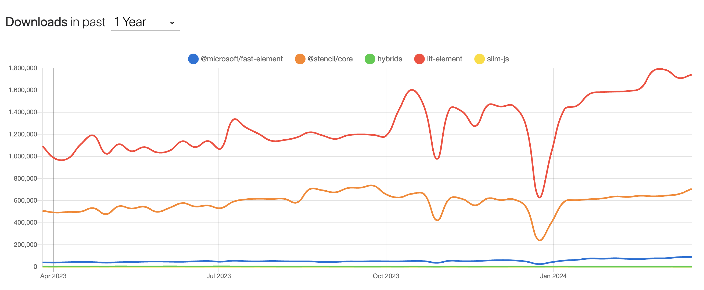
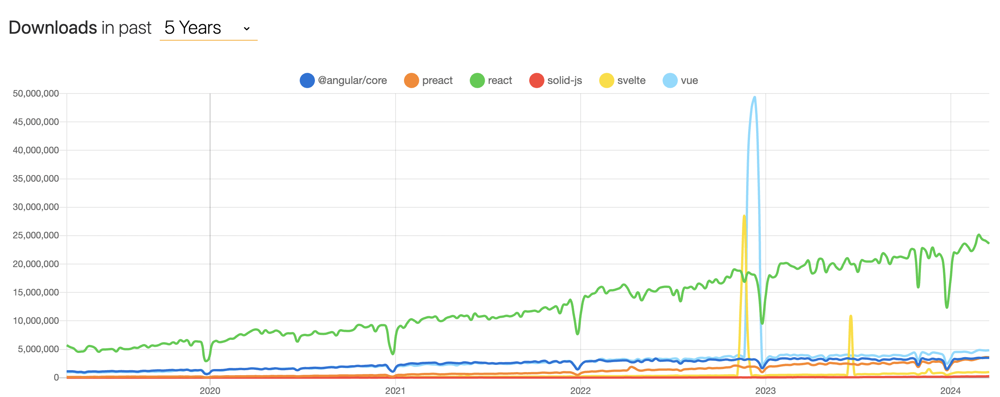

# Design System

The creation of an OGCIO design system.

## Status

Proposed

## Context

The [OGCIO design system](https://github.com/ogcio/ogcio-ds) is an open-source project that implements around 45 components including typography, layout, navigation, form, and application components. This provides a standard look and feel across projects without the additional development effort of duplicating component functionality for every OGCIO application.

However, adoption is low due to:

- Difficulty of setup
- Build tooling required for styling (SASS)
- Non-idomatic component APIs
- Insufficient documentation and examples
- Bespoke implementation makes it hard to contribute and reduces productivity
- Team topologies make support difficult

The issues of the existing design system lie both in the _API_ and the _implementation_.

### API Issues

Styling is managed through [SASS](https://sass-lang.com/), necessitating particular build tooling as part of project setup. Additionally, the component APIs present adoption challenges, as consumers must utilise low-level HTML attributes rather than component properties.

For example, a basic button:

```html
<button data-module="govie-button" class="govie-button">Text</button>
```

The `data` attribute here is required for the design system to add the appropriate interactivity as side effects to the button when the appropriate JavaScript is included in the page. The `class` is required for styling the button.

Both the `data` and `class` attributes are optional, and leaving them out would break styling or interactivity.

Compare that to the [button](https://shoelace.style/components/button) component of [Shoelace](https://shoelace.style/) (a modern library of Web Components):

```html
<sl-button>Text</sl-button>
```

Here, the interactivity and styling are built in to the web component. Consumers cannot accidentally disable interactivity, and they can change the type of button (and receive automatic styling) via a provided `variant` property, rather than being allowed to apply any arbitrary style via `class`:

```html
<sl-button variant="warning">Text</sl-button>
```

This encapsulation is key to protecting component invariants and simplifying component consumption.

You can see how the lack of encapsulation results in an explosion of repeated markup for an only moderately more detailed component such as an accordion:

```html
<div
  class="govie-accordion"
  data-module="govie-accordion"
  id="accordion-default"
>
  <div class="govie-accordion__section ">
    <div class="govie-accordion__section-header">
      <h2 class="govie-accordion__section-heading">
        <span
          class="govie-accordion__section-button"
          id="accordion-default-heading-1"
          >Understanding agile project management</span
        >
      </h2>
      <div
        class="govie-accordion__section-summary govie-body"
        id="accordion-default-summary-1"
      >
        Introductions, methods, core features.
      </div>
    </div>
    <div
      id="accordion-default-content-1"
      class="govie-accordion__section-content"
      aria-labelledby="accordion-default-1"
    >
      <ul class="govie-list">
        <li>
          <a class="govie-link" href="#"
            >Agile and government services: an introduction</a
          >
        </li>
        <li>
          <a class="govie-link" href="#">Agile methods: an introduction</a>
        </li>
        <li>
          <a class="govie-link" href="#">Core principles of agile</a>
        </li>
      </ul>
    </div>
  </div>
  <div class="govie-accordion__section ">
    <div class="govie-accordion__section-header">
      <h2 class="govie-accordion__section-heading">
        <span
          class="govie-accordion__section-button"
          id="accordion-default-heading-2"
          >Working with agile methods</span
        >
      </h2>
      <div
        class="govie-accordion__section-summary govie-body"
        id="accordion-default-summary-2"
      >
        Workspaces, tools and techniques, user stories, planning.
      </div>
    </div>
    <div
      id="accordion-default-content-2"
      class="govie-accordion__section-content"
      aria-labelledby="accordion-default-2"
    >
      <ul class="govie-list">
        <li>
          <a class="govie-link" href="#"
            >Creating an agile working environment</a
          >
        </li>
        <li>
          <a class="govie-link" href="#">Agile tools and techniques</a>
        </li>
        <li>
          <a class="govie-link" href="#">Set up a team wall</a>
        </li>
        <li>
          <a class="govie-link" href="#">Writing user stories</a>
        </li>
        <li>
          <a class="govie-link" href="#">Planning in agile</a>
        </li>
        <li>
          <a class="govie-link" href="#">Deciding on priorities</a>
        </li>
        <li>
          <a class="govie-link" href="#">Developing a roadmap</a>
        </li>
      </ul>
    </div>
  </div>
  <div class="govie-accordion__section ">
    <div class="govie-accordion__section-header">
      <h2 class="govie-accordion__section-heading">
        <span
          class="govie-accordion__section-button"
          id="accordion-default-heading-3"
          >Governing agile services</span
        >
      </h2>
      <div
        class="govie-accordion__section-summary govie-body"
        id="accordion-default-summary-3"
      >
        Principles, measuring progress, spending money.
      </div>
    </div>
    <div
      id="accordion-default-content-3"
      class="govie-accordion__section-content"
      aria-labelledby="accordion-default-3"
    >
      <ul class="govie-list">
        <li>
          <a class="govie-link" href="#"
            >Governance principles for agile service delivery</a
          >
        </li>
        <li>
          <a class="govie-link" href="#">Measuring and reporting progress</a>
        </li>
        <li>
          <a class="govie-link" href="#"
            >Spend controls: check if you need approval to spend money on a
            service</a
          >
        </li>
        <li>
          <a class="govie-link" href="#"
            >Spend controls: apply for approval to spend money on a service</a
          >
        </li>
        <li>
          <a class="govie-link" href="#"
            >Spend controls: the new pipeline process</a
          >
        </li>
        <li>
          <a class="govie-link" href="#"
            >Working across organisational boundaries</a
          >
        </li>
      </ul>
    </div>
  </div>
</div>
```

Compare that to the Adobe Spectrum [accordian](https://opensource.adobe.com/spectrum-web-components/components/accordion/) web component:

```html
<sp-accordion>
  <sp-accordion-item label="Heading 1">
    <div>Item 1</div>
  </sp-accordion-item>
  <sp-accordion-item disabled label="Heading 2">
    <div>Item 2</div>
  </sp-accordion-item>
  <sp-accordion-item label="Heading 3">
    <div>Item 3</div>
  </sp-accordion-item>
  <sp-accordion-item label="Heading 4">
    <div>Item 4</div>
  </sp-accordion-item>
  <sp-accordion-item label="Heading 5">
    <div>Item 5</div>
  </sp-accordion-item>
  <sp-accordion-item label="Heading 6">
    <div>Item 6</div>
  </sp-accordion-item>
</sp-accordion>
```

The implementation of the design system was forked from GOV.UK, itself constrained by a requirement to support Internet Explorer 8 and above. This prevented a use of modern web standards such as web components. Internet Explorer was officially retired, and dropped out of support as of June 15th 2022.

By lifting that constraint, it becomes possible to develop new components that are easier to maintain, easier to consume, and leverage contemporary web standards to be compatible across multiple platforms.

### Implementation Issues

- Bespoke component implementation
- SASS build tooling required for styling
- Lack of consistent component API
- No use of TypeScript
- Internet Explorer 8 supporting code
- Aging tests not run on CI
- Storybook stories written imperatively
- End-of-Life Node version

## Considerations

### Ease of Use

The success of the design system will be measured by its reuse and the development effort saved across multiple projects and applications.

Having a low barrier to entry is essential for adoption, this means:

- Ease of installation
- Ease of customisation
- Appropriate levels of customisation
- Rich feature set
- Detailed documentation and examples
- Open for collaboration and contributions
- Ongoing support and maintainence

### Team structure

Designing products and digital experiences is a collaborative, cross-functional process that requires alignment and a shared language.

Design systems are the shared language used across design and development teams to create a shared narrative around colors, character styles, components and more.

The team topology will need to be carefully considered to optimise design system design, implementation, testing, and support.

TODO: team setup options

### Components

TODO: description of approaches to components

[Web Components](https://www.webcomponents.org/introduction) are made up of four specifications:

| Specification   | Description                                                                                                          |
| --------------- | -------------------------------------------------------------------------------------------------------------------- |
| Custom Elements | Lays the foundation for designing and using new types of DOM elements.                                               |
| Shadow DOM      | Defines how to use encapsulated style and markup in web components.                                                  |
| ES Modules      | Defines the inclusion and reuse of JS documents in a standards based, modular, performant way.                       |
| HTML Template   | Defines how to declare fragments of markup that go unused at page load, but can be instantiated later on at runtime. |

> Integration with Custom Elements is supported by [all major frameworks](https://custom-elements-everywhere.com/) except rich data and events in React 18. Full Custom Element support [is due in React 19](https://github.com/facebook/react/issues/11347), which is expected to be released in 2024 or early 2025.

Web components are used in production by YouTube, Adobe, Google Maps, Bing etc. Tooling is often used to simplify the development of web components (as of 26/03/2024):

| Tool                                            | Stars  | Issues | Version |
| ----------------------------------------------- | ------ | ------ | ------- |
| [Stencil](https://stenciljs.com/) (Ionic)       | 12,243 | 395    | 4.13.0  |
| [Hybrids](https://github.com/hybridsjs/hybrids) | 2,954  | 4      | 8.2.14  |
| [Lit](https://lit.dev/) (Google)                | 17,339 | 482    | 4.0.4   |
| [slim.js](https://slimjs.com/)                  | 1,000  | 14     | 5.0.10  |
| [FAST](https://www.fast.design/) (Microsoft)    | 8,971  | 421    | 2.30.6  |



### Design Systems

See [Design Systems](./design-systems.md)

### Design Tokens

See [Design Tokens](./design-tokens.md)

### Styling

TODO

### Theming

TODO

### Responsive Design

TODO

### Accessibility

TODO

### Localisation

TODO

### Animation

TODO

### Documentation

TODO

- Storybook
- Static documentation site (e.g. [Eleventy](https://www.11ty.dev/), [Next.js](https://nextjs.org/), [Astro](https://astro.build/))

### Server Side Rendering

The industry is [moving away from client side rendering](https://www.infoworld.com/article/3686649/server-side-rendering-is-having-a-moment.html) and back to rendering markup on the server, for UX, SEO, and progressive enhancement benefits.

**Server side rendering is possible with Web Components, but it's not a first-class citizen.**

There are SSR packages for Web Component tooling:

- [Lit SSR](https://lit.dev/docs/ssr/overview/)
- [Stencil Hydrate App](https://stenciljs.com/docs/hydrate-app)
- [FAST SSR](https://github.com/microsoft/fast/tree/master/packages/web-components/fast-ssr)

However, integration of Web Components with popular SSR supporting frameworks is not currently supported, e.g:

- Next.js [app router](https://nextjs.org/docs/app) has [no integration story](https://github.com/vercel/next.js/discussions/51717).
- Remix has [no integration story](https://github.com/remix-run/remix/issues/5888)

There are integration attempts, but they are heavy with caveats and warnings:

- https://css-tricks.com/using-web-components-with-next-or-any-ssr-framework/
- https://github.com/smartive/stencil-nextjs-example/tree/main/packages/stencil-react-ssr-output-target

### Testing

TODO

### Package Design

Scope per UI framework, e.g:

```
@ogcio-react/*
@ogcio-angular/*
@ogcio-web/*
```

Prefix per UI framework, e.g:

```
@ogcio/react-*
@ogcio/angular-*
@ogcio/web-*
```

## Proposals

TODO: Pros/cons of various options

### Modernise existing design system vs additional components

TODO

### React everywhere

React is still the dominant UI framework (as of 26/03/2024):

| Framework     | Stars   | Issues | Version |
| ------------- | ------- | ------ | ------- |
| @angular/core | 94,258  | 1,602  | 17.3.1  |
| preact        | 35,944  | 243    | 10.20.1 |
| react         | 220,688 | 1,586  | 18.2.0  |
| solid-js      | 30,820  | 78     | 1.8.16  |
| svelte        | 76,005  | 995    | 4.2.12  |
| vue           | 44,091  | 1,097  | 3.4.21  |



**Pros**

- Huge ecosystem
- Lots of innovation
- Headless component libraries available
  - Radix
  - Headless CMS
  - React ARIA
- Huge effort been made making components _truely_ accessible (e.g. React ARIA)

**Cons**

- Churn, Class Components -> Hooks -> React Server Components, so the paradigms shift
- TODO

### Native Platform Components

TODO: React and Angular components

### Hybrid

TODO: Mixture of Web Components and Native Platform Components

### Web Components

TODO: Use of Web Components including React wrapper

## Decision

The ultimate aspiration for a contemporary design system would include:

- Writing code once
- Running anywhere (React, Angular, Vue, vanilla JavaScript etc)
- Future proofing (support any forthcoming framework)
- Supporting Server Side Rendering (SSR)

Web Components allow a single codebase to be maintained and promise platform agnosticism, however there are two serious issues with their adoption:

- React 18 has only [basic support for Custom Elements](https://custom-elements-everywhere.com/libraries/react/results/results.html) (React 19 is expected to have advanced support, likely due in 2024 or early 2025)
- Web Component Server Side Rendering support is immature, e.g. it may take considerable time for Next.js app router and Remix support (and that's just frameworks in the React space)

The first issue is resolved with automatically generated wrappers for React that are supported by both [Lit](https://lit.dev/docs/frameworks/react/) and [Stencil](https://stenciljs.com/docs/react). The Server Side Rendering issue will be resolved over time, but it's difficult to know a realistic time frame.

Additionally, there are other related issues with Web Components:

- Web Component APIs do not conform to the conventions of individual frameworks. However slight, the developer experience may deviate from typical framework usage, even if automatic wrappers are generated for each framework.
- Component libraries originally developed for UI frameworks such as React cannot be directly utilised in component implementation. As a consequence, there is a loss of access to implementations that are highly accessible, performant, mature, and thoroughly tested.
- The engineering experience with Web Components will be comparatively lower than that of specific frameworks such as React or Angular. Consequently, productivity and contributions from teams external to the design system team will be impacted.

### Recommendations

Given the current state of Web Components in Q1 2024, and other issues identified, a **hybrid approach is recommended**.

This means supporting multiple versions of each component, e.g. Web Component, React, and Angular implementations.

The decision on the exact supported implementations can be made on a component by component basis. Not every component has be implemented in every supported framework. The decision will be based on:

- If the component is likely to be used in an SSR context
- If the component requires client side interactivity
- If Client Side Rendering (CSR) is primarily used within a project that will utilise the component

It's suggested given the lack of advanced support for Web Components in React 18, and the current adoption of React within OGCIO, that React component implementations are supported, at least until an improved Web Component story in the React space (React 19, Next.js app router, Remix etc).

If Angular is a significantly utilised UI framework within OGCIO, then SSR usage will have to be considered. It may be that a React and Web Component implementation of components would be sufficient if SSR usage is low within the Angular space.

TODO: stats on framework usage within OGCIO

Longer term, a migration to a Web Component implementation of each component would provide the platform agnosticism and single codebase benefits. It may be that the native implementations could then be deprecated if the Web Component developer experience and SSR support is sufficient in future.

In summary:

- Decide on one or more implementations on a component by component basis, up to and including React, Angular, and Web Component implementation
- Prioritise components that offer the most value for features in active development
- Prioritise implementations that offer the required features and best developer experience for features in active development
- Each implementation can be styled by the same centralised design tokens
- Each component API will be idomatic to the particular platform, e.g:
  - Web Component - CSS Shadow Parts and Shadow Tree Slot Element (TODO: more info)
  - React - Render prop with default render, or hooks based implementation (TODO: more info)
  - Angular (if supported, TODO: API approach)
- Optimise for disposability via suitable abstractions and package granularity
- Documentation in Storybook, including which frameworks are supported per component
- Build for purpose, developing components integrated with production code, in collaboration with product teams
- Longer term preference for Web Components once UI framework integration and Server Side Rendering are fully mature

## Consequences

What becomes easier or more difficult to do because of this change?

TODO

## Approach

- [ ] Create design tokens package
- [ ] Create themes package for React support (Tailwind?)
- [ ] Create initial Storybook setup
- [ ] Build icons components package for React
- [ ] Build layout components package for React (footer, header etc)
- [ ] Build navigation components package for React (main menu, link etc)
- [ ] Build charting components package (TODO: determine granularity) for React

Consider a thin vertical slice of a single fully featured component:

- [ ] Figma design and integration
- [ ] Testing (unit, e2e)
- [ ] Responsive (mobile first) design
- [ ] Storybook stories
- [ ] API design
- [ ] Styling
- [ ] Dark mode
- [ ] CSS Variables as Design Tokens
- [ ] Monorepo setup
- [ ] Linting
- [ ] Format check
- [ ] Packaging, versioning, deployment (internal GitHub?)
- [ ] Documentation from component metadata
- [ ] Rendering Parts and Slots in Storybook (see Solid Design)
- [ ] Example usage in React, Angular, Next.js/Remix
- [ ] CSS Custom Properties?
- [ ] Animation?
- [ ] Server Side Rendering?
- [ ] Lazy loading?

Once a standarised component API (customising component behaviour, overriding styles etc) approach has been discovered, then this can be applied to further components, building one granular package of related components at a time.
