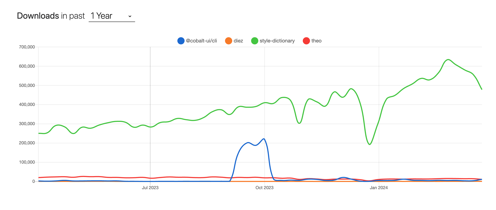

# Design Tokens

Design tokens are the single source of truth to name and store design decisions, distributed so that teams can use them across design tools and coding languages.

Design tokens values can include the following:

- Fonts
- Colors
- Spacing
- Radii
- Animation
- Shadows
- etc

Most teams define them in a platform agnostic format, e.g. JSON, and compile them down to the formats they require, e.g. CSS:

```json
{
  "colors": {
    "blue": {
      "600": "212.9,84%,49%"
    }
  }
}
```

```css
 {
  --govie-color-blue-600: hsl(212.9, 84%, 49%);
}
```

There has been an attempt to standardise design tokens with the [Design Tokens Community Group (DTCG)](https://design-tokens.github.io/community-group/) and a [design token format](https://design-tokens.github.io/community-group/format/).

There is tooling available that supports this standard and provides functionality to export to a variety of formats including CSS and Figma.

The most popular open-source tooling (as of 26/03/24):

| Design Token Tool                                                     | Stars | Issues | Version | Updated      | Created      |
| --------------------------------------------------------------------- | ----- | ------ | ------- | ------------ | ------------ |
| [Style Dictionary](https://github.com/amzn/style-dictionary) (Amazon) | 3,612 | 211    | 3.9.2   | 3 months ago | 7 years ago  |
| [Cobolt](https://github.com/drwpow/cobalt-ui)                         | 124   | 15     | 1.11.0  | 4 days ago   | 2 years ago  |
| [Theo](https://github.com/salesforce-ux/theo)                         | 1,934 | 30     | 8.1.5   | 4 years ago  | 10 years ago |
| [Diez](https://github.com/diez/diez)                                  | 1,225 | 58     | 10.6.0  | 4 years ago  | 9 years ago  |



Design systems typically use a multiple tiers of design tokens, e.g:

| Design Token Tier  | AKA       | Description                                               | Example                                   |
| ------------------ | --------- | --------------------------------------------------------- | ----------------------------------------- |
| Primitive          | Global    | Define every value in a property's system                 | `color/blue/600`                          |
| Semantic           | Shared    | Convey meaning and how and where the asset should be used | `surface/primary`                         |
| Component-specific | Component | Component specific usage                                  | `button-primary-background-color-default` |

## Decision

### Tiers

The design tokens will use a three tier system:

- Primitive
- Semantic
- Component

Some general rules can be applied:

- Primitive tokens should not be referenced directly in component implementations or Figma designs
- Components should be built with a mixture of semantic or component tokens
- Primitive tokens are literal values
- Semantic tokens can alias primitive tokens only
- Component tokens can alias semantic or primitive tokens

### Naming

#### Primitive

- type/variant/[subVariant]
- Examples - `color/blue/500`, `font/size/100`, `font/weight/500`

#### Semantic

- type/variant
- Examples - `surface/primary`, `surface/brand-contrast`

#### Component

- type/variant-property-state
- Examples - `button/primary-background-color-default`, `button/secondary-background-color-hover`

## Resources

- https://medium.com/eightshapes-llc/naming-tokens-in-design-systems-9e86c7444676
- https://github.com/divriots/style-dictionary-to-figma
- https://docs.tokens.studio/
