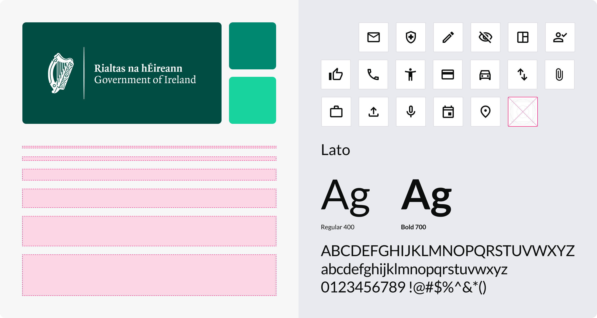

# Government of Ireland Design System — Figma

The official Figma design system file for the Government of Ireland.

This repository provides the versioned `.fig` file used to build and maintain the design system. It is intended for designers and teams working with the Design System in Figma.

 

## Status

> ⚠️ **Beta**
>
> This release currently includes **Foundations only**.  
> Naming, structure, and design tokens may change as components are finalised and approved.

 

## Figma file

- **[`GovIrelandDesignSystem.fig`](./GovIrelandDesignSystem.fig)** — Design System library file

 

## Using the Design System in Figma

### Import the library file

1. Download `GovIrelandDesignSystem.fig` from this repository  
2. In Figma, go to **File → Import**  
3. Select the `.fig` file  
4. Open the imported file in your Figma workspace

This creates a local copy of the Design System file in your space. **It will not update automatically when new versions are released.**

### Enable and use as a library

1. Open the imported Design System file  
2. Go to **Assets → Libraries**  
3. Enable the Design System library  
4. Open your own design file  
5. Insert components from the **Assets** panel

### Recommended usage

- Use components and styles directly from the Design System library  
- Keep components linked to the library to receive future updates within your file  
- When a new version is released, download and import the latest `.fig` file to update your local copy  

This helps keep designs consistent and makes updates easy to apply across teams.

 

## What’s included

### Foundations

- **Colour** — primitive and semantic colours
- **Icons** — icon set and logos
- **Layout** — spacing scale, grids, container sizes
- **Typography** — fonts, type scale, weights, line height, and letter spacing

 

## Versioning and updates

- Each GitHub release includes a versioned `.fig` file  
- Updates are published when foundations or components are ready for release  
- See **Releases** for details on what has changed
